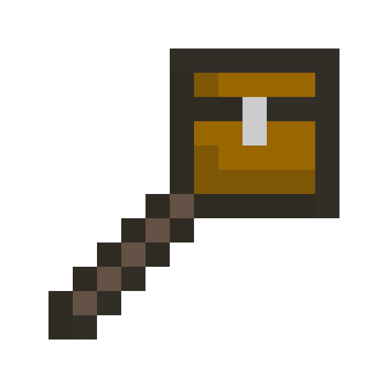
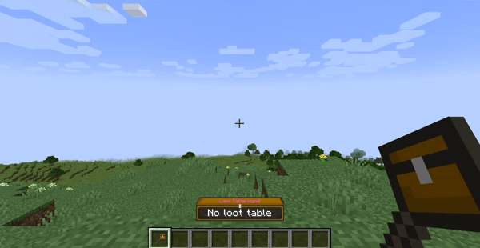
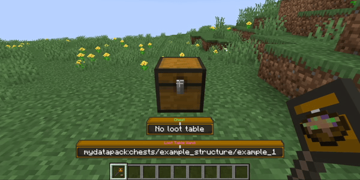
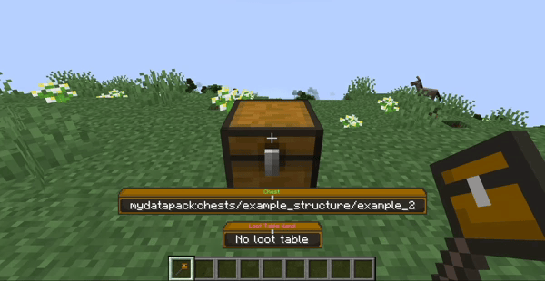
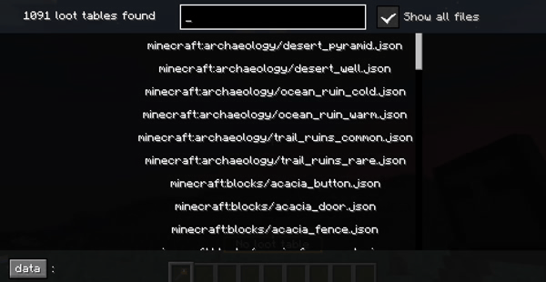
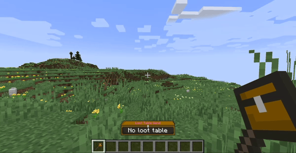
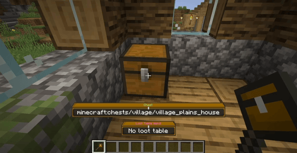

| [Download on Modrinth](https://modrinth.com/mod/loot-table-wand) | [Download on Curseforge](https://www.curseforge.com/minecraft/mc-mods/loot-table-wand) |
|------------------------------------------------------------------|----------------------------------------------------------------------------------------|

# Loot Table Wand Mod

### New operator tool: Loot Table Wand
- Interact with container blocks like chests, barrels and shulker boxes
- Append, remove, copy and inspect container loot tables
- Browse all loaded loot tables (vanilla, mods, datapacks)
- View any loot table in one of two modes:
  1. Raw entry data (rolls, bonus rolls, weight, quality, count)
  2. Calculated data (chance to obtain, average count obtained, tries to get)
- Loot item preview in your inventory

### Use cases

- Simplify structure building (no more /data commands for loot)
- Learn more about loot tables (vanilla or other mods)

## Select loot tables

- Double-click to select loot tables
- Store up to 10 loot tables per wand (90 in hotbar, 270 in inventory)
- Use the stored loot tables to:

## Modify loot tables

- Right-click: Append loot table
- Left-click: Remove loot table
- Hold shift to open/destroy the container instead

## Copy loot tables

- Middle-click: Copy container loot table
- Hold shift to pick the container instead
- You can append the copied loot table to other containers

## Browse loot tables

- See all loaded loot tables in the browser
- Toggle between folders and all files at once
- Store or inspect loot tables from the browser

## Inspect loot tables

- K: Inspect container loot table
- View the loot tables as visualized tables
- Switch between two visualization modes

### Help translate this mod: https://crowdin.com/project/loot-table-wand
